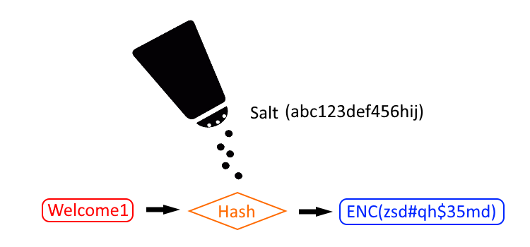

# Security Salt and Hash

In MyST Studio 6.6.0 (introduced in rc2) there were password security enhancements to how MyST encrypts passwords. This article explains the changes to the enhanced password encryption.

## Before and After Password Security Enhancement

### Before 6.6.0 (rc2)

In previous versions passwords were encrypted in AES format seen as:
```
my.custom.password={AES}AZ12azasfdASDF9876asdf\=\=
```

### After 6.6.0 (rc2)

Two key points.
1. A salt (file) is generated on initial startup and is used to hash myst properties that are passwords.  
   `/opt/myst/data/key`
2. On initial startup a myst studio database entry is populated to flag the salt has been generated. This prevents a new salt file being generated and overwriting the previous.

## What does this mean for existing users?

Users upgrading to the new password security enhancement will find their existing passwords remain `{AES}` encrypted. To use the new salt, simply update existing password properties and myst will use the salt and hash the password as `ENC()`.

## The Master key

A **salt** (also referred to as the *key*) is used to encrypt and decrypt passwords. 

### Where is the key?

The salt is placed in a file named "**key**" located inside the myststudio_web docker container.
`myststudio_web:/opt/myst/data/key`

When performing actions, Myst will copy the key onto the filesystem `$MYST_HOME/key` in order for MyST CLI to access.

### How is the key file mounted?

The key file location is mounted using [docker volumes](https://docs.docker.com/storage/volumes/) part of the docker image. You do not need to do anything. Upgrading or recreating the container does not affect the key file as it is persisted. If you delete the docker volume then the key will be deleted.

Execute the command `docker inspect myststudio_web`, to see the volume location.
```
            "Image": "myst-studio",
            "Volumes": {
                "/opt/myst/data": {},
                "/usr/local/tomcat/conf/fusioncloud/ext": {},
                "/usr/local/tomcat/conf/fusioncloud/license": {}
            },
```

### Importance of Backing up the key

It is important backup the key as it is uniquely generated on initial startup.

Every password which is encrypted using the key can only be decrypted correctly using the same key. 

#### Extracting the key for backup purposes

Use below commands to view the key contents.

Note: The key file supports 15 characters with **no new line character**.
```
# Print the key contents to standard out
docker exec -ti myststudio_web /bin/bash -c 'cat /opt/myst/data/key'

# Copy the key file
docker cp myststudio_web:/opt/myst/data/key /tmp/key'
```

#### Creating the key for backup purposes

Alternatively you can create the key. Remember, **no** new line character.

```
# The -n prevents a new line
echo -n abc123def456hij > key

# Validate the key has 15 characters (and no new line character)
wc -c key

# The result should be:
15 key
```

## What does this mean for new users?

After installing myst studio and starting for the first time a salt will be generated and all passwords are encrypted using the salt. It would simple be a matter of ensuring the `/opt/myst/data/key` salt (file) is backed up in a secure repository.

