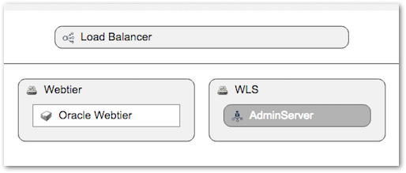
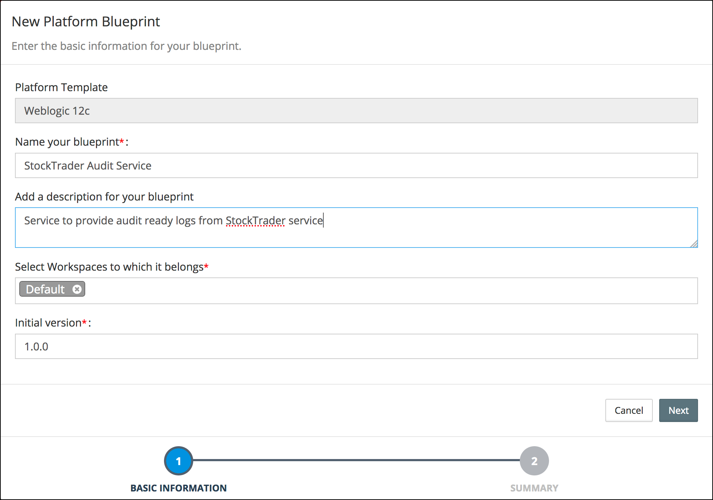
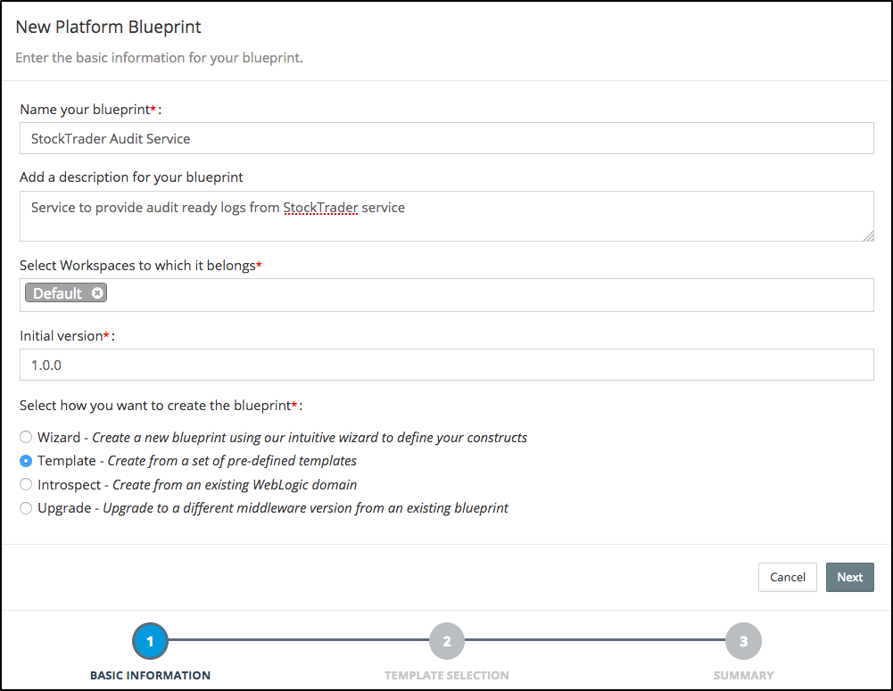
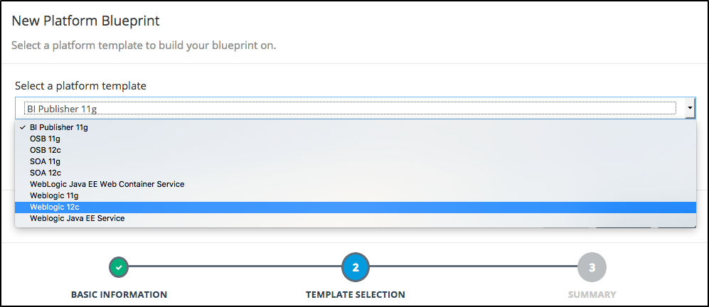
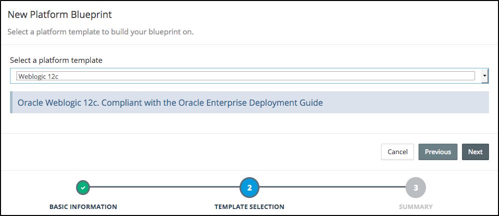
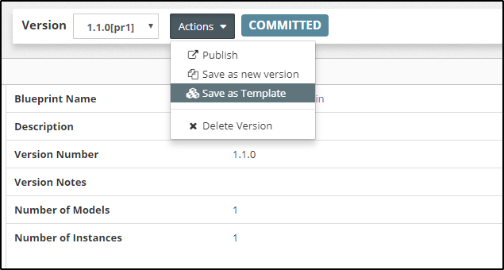
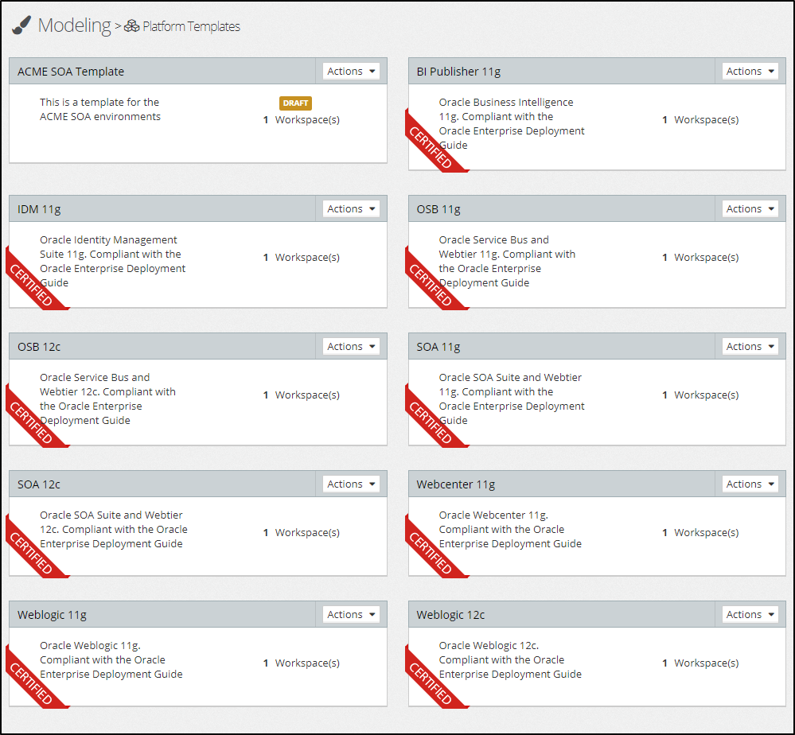
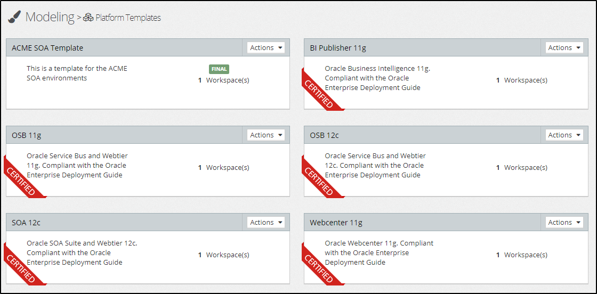

## {{ page.title }}
A Platform Template provides a definition of a specific middleware topology and configuration that can be used as the basis for creating a [Platform Blueprint](/platform/blueprints/README.md).

Platform Templates provide a number of key advantages:

* **Catalog** - Rich set of _certified_ Platform Templates are provided out-of-the-box with MyST Studio, each representing a proven best-practice approach as defined in the Oracle Fusion Middleware Enterprise Deployment Guide  
* **Reuse** - Any number of Platform Blueprints can be created from a Platform Template, enabling the continual reuse of known topologies and configurations, saving time and effort in defining new platforms
* **Certified Best Practices** - Provide definitions of tested and certified platforms that are based on the documented best practices from Oracle
* **Knowledge Capture** - Once a Platform Blueprint has been created and approved, it can easily be converted into a Platform Template, preserving all of the knowledge that has been applied to the Platform Blueprint

## Platform Template Catalog
MyST Studio provides a Catalog containing a set of certified Platform Templates for an array of Fusion Middleware products, with each template representing a best-practice topology based on the Oracle Fusion Middleware Enterprise Deployment Guide.  As new Platform Templates are saved from  Platform Blueprints they are added to the Catalog.

To access the Catalog, from the side menu navigate to the `Modeling` > `Platform Templates` option.

Within the Catalog the certified Platform Templates are clearly denoted with a red **certified** band.  Custom Platform Templates created from Platform Blueprints are marked with a **draft** or **final** marking based on their current state.


**Certified** Platform Templates represent known and tested best practice configurations and are not able to be modified.

### Certified Platform Templates

| Name | Description | Topology |
| ---- | ----------- | -------- |
| **BI Publisher 11g** | Oracle Business Intelligence 11g. Compliant with the Oracle Enterprise Deployment Guide | |
| **OSB 11g** | Oracle Service Bus and Webtier 11g. Compliant with the Oracle Enterprise Deployment Guide | |
| **SOA 11g** |Oracle SOA Suite and Webtier 11g. Compliant with the Oracle Enterprise Deployment Guide| |
| **WebLogic 11g**|Oracle Weblogic 11g. Compliant with the Oracle Enterprise Deployment Guide||
| **OSB 12c**|Oracle Service Bus and Webtier 12c. Compliant with the Oracle Enterprise Deployment Guide||
| **SOA 12c**|Oracle SOA Suite and Webtier 12c. Compliant with the Oracle Enterprise Deployment Guide||
| **WebLogic 12c**|Oracle Weblogic 12c. Compliant with the Oracle Enterprise Deployment Guide||

## Using Platform Template to Create Platform Blueprint
MyST Studio provides two approaches to create a Platform Blueprint from a Platform Template.  Both approaches result in the same work flow to create the Platform Blueprint.


For a full description of the Platform Blueprint concept, see the [Platform Blueprints](../blueprints) section.

### Option 1: Generate Platform Blueprint from Platform Templates Catalog
From the side menu, navigate to `Modeling` > `Platform Templates`.  This will display the platform templates Catalog.  Click the `Action` > `Generate Blueprint` option on the desired Platform Template to start the Platform Blueprint creation process.

This will launch the New Platform Blueprint wizard with the Platform Template value **_preset_** with the chosen template.  Specify a **Name** and a **Description** for the new Platform Blueprint and click `Next`.

 On the summary screen review the details of the new Platform Blueprint and click **Finish** to complete the process.

 

### Option 2: Create Platform Blueprint using Template Option
From the side menu navigate to `Modeling` > `Platform Blueprint`. This will display a list of existing Platform Blueprints. Click on `Create New` in the top right-hand corner of the screen. This will launch the **New Platform Blueprint** wizard.

Enter a **Name** and **Description** for the new blueprint. Select the `Template - Create from a set of pre-defined templates` option from the list of blueprint create options and click `Next` to continue.

From the list of available Platform Templates, select the required template on which to base the new blueprint.  Click `Next` to continue.

Review the details of the new Platform Blueprint and click `Finish` to complete the process.

## Creating a Platform Template from a Platform Blueprint

In addition to providing pre-defined and certified Platform Templates, MyST Studio also enables custom Platform Templates to be created and published in the catalog.  This is done by saving a Platform Blueprint as a Platform Template, capturing all of the topology definition and configurations that have been made on Platform Blueprint and saving it as a Platform Template.

### Save Blueprint as Template

From the side menu navigate to `Modeling` > `Platform Blueprint`. This will display a list of existing Platform Blueprints.  Click on the desired blueprint to open it for viewing.

From the Platform Blueprint editor, click the `Actions` button and select the `Save as Template` option.


A blueprint must be in a committed state before it can be saved as a template.

In the New Platform Template dialog specify the **Name** and a **Description** for the new Platform Template and click `Save` to complete the process.

### Review and Edit Template

From the side menu navigate to `Modeling` > `Platform Templates`. This will display a list of existing Platform Templates.  A new template will be marked with `Draft`.  Clicking on the template will open it for viewing.

For a template in `Draft` mode, additional changes can be made to its configuration using the `Edit Configuration` button.  

## Publish Template

Once a template has been finalized, it can be published and marked as `Final`.  This locks the template and prevents any further changes being made to it.

