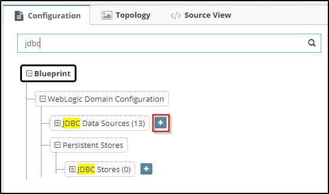
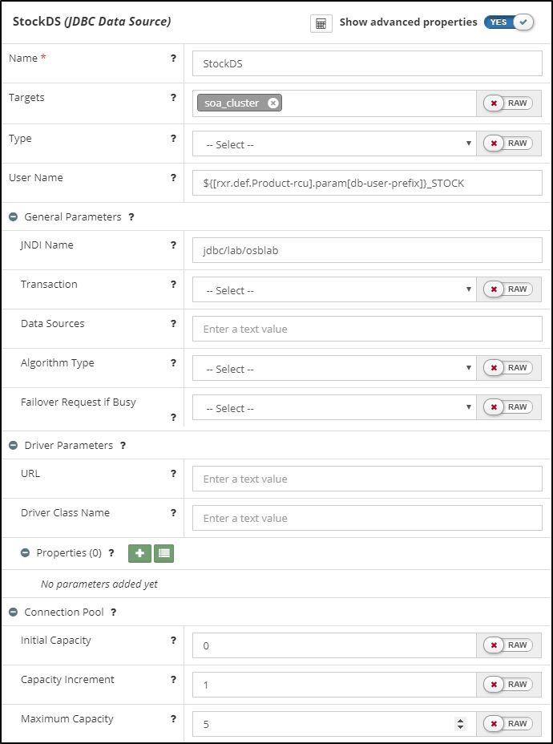
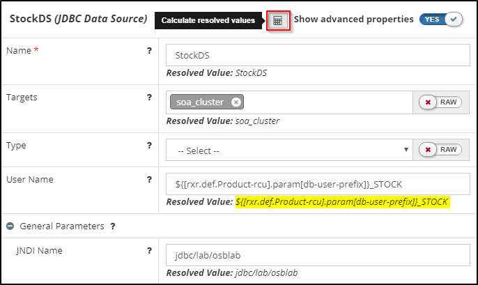
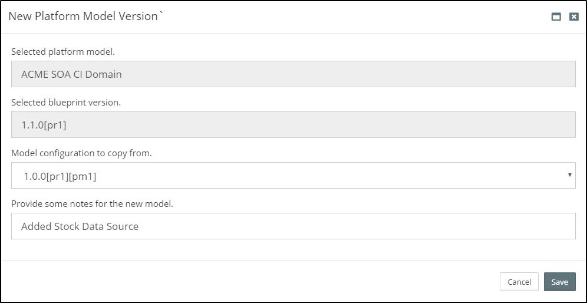
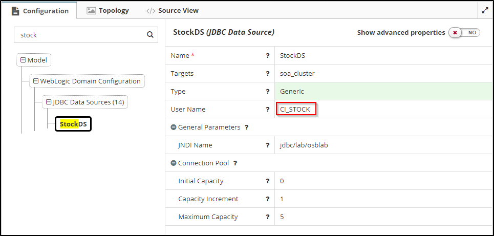
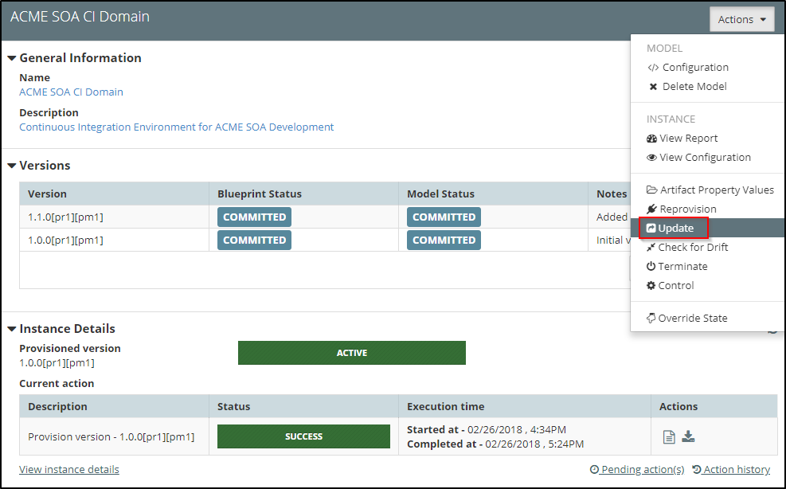
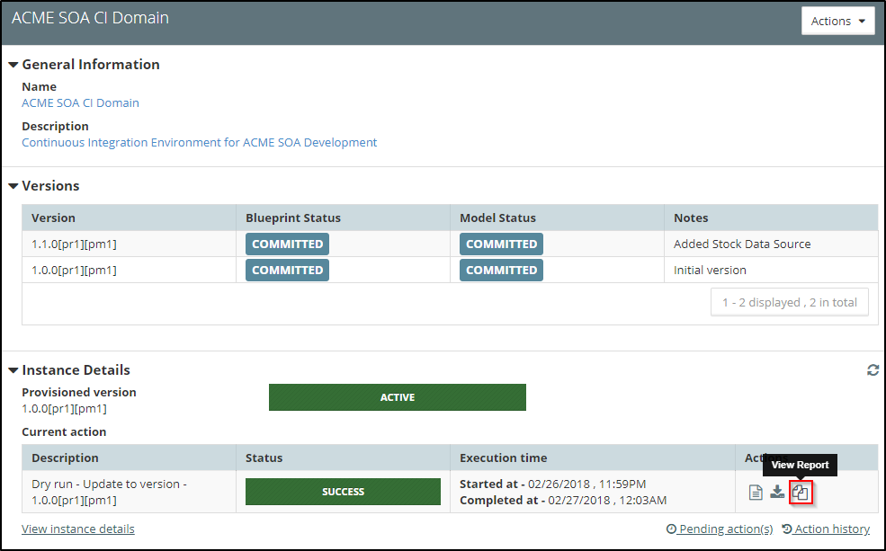
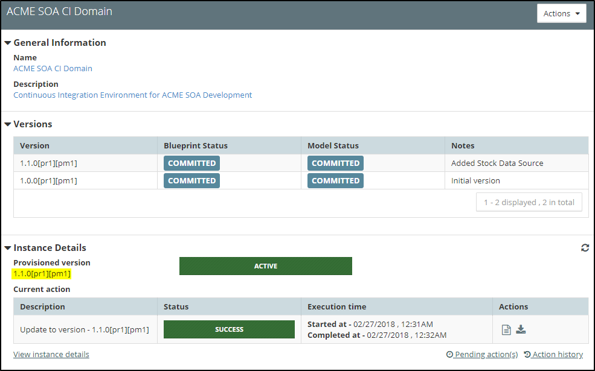

## {{ page.title }}

To make configuration changes to a Platform Instance, we need to first update it's *platform definition* as specified by its Platform Blueprint and Platform Model. Once we're happy with our revised *platform definition* we can run a platform update. MyST will automatically determine and perform the required steps to apply the necessary changes.

For the purpose of this section, we are going to walk through the process of adding a new Data Source to our Platform Instance. This involves the following steps:

1. Adding a Data Source to our Platform Blueprint  
2. Adding environment specific details to our Platform Model  
3. Performing an optional dry run to verify our changes  
4. Performing an update against the Platform Instance to apply our changes

### Update Platform Blueprint
When we update a Platform Blueprint we can either do this as a revision to the current blueprint, assuming its state is not FINAL, or create a new version of the Platform Blueprint. For our example, we are going to create a new version.

#### Create New Version of a Platform Blueprint
From the side menu navigate to`Modeling` > `Platform Blueprints`, this will display a list of existing Platform Blueprints. Click on the `Actions` drop-down in the top right-hand corner of the Platform Blueprint we want to view/edit and select `Open`. This will open the Platform Blueprint in the `Platform Editor` in view mode.

To create a new version of a Platform Blueprint, ensure the correct version of the Platform Blueprint is selected in the `Control Bar` then click on the `Actions` drop-down and select `Save as new version` (outlined in red below).

This will open the `New Platform Blueprint Version` dialog. This will confirm the selected Platform Blueprint and version that we are going to base our new version on. 

Here we need to specify the version number for our new Platform Blueprint. In addition, we can specify some notes that detail the reason for the new version. These notes will appear in the version history for any Platform Instance once updated to this version of the Platform Blueprint.

Once complete, click `Save`. This will create the new version of our Platform Blueprint and return us to the `Platform Editor`. Here we can see that the `Control Bar` displays the version (outlined in red below) of our new Platform Blueprint and that it has a status of `DRAFT`.

#### Adding a Data Source
Click on `Edit Configuration`. In the tree view, search for `jdbc` and locate `+` icon next to JDBC Data Sources (outlined in red).

This will open a modal dialog where you can enter the name of the data source as shown in the example below.

The new data source should now be auto-selected and available for editing. We will see that initially none of its properties apart from the name have been set.


An alternative way of creating a new Data Source is to select an existing data source, right click on it and select clone.


Now fill out the remaining properties for the data source. MyST tries to provide as much guidance as possible by showing help (`?`) for each property and wherever applicable, restricting values that can be entered. For the purpose of our example, we will set the properties shown in the screen shot below.

It's worth noting that we have used MyST properties to define the value of the `User Name` property. 
* `User Name` is set to `${[rxr.def.Product-rcu].param[db-user-prefix]}_STOCK`

Click the `Calculate resolved values` button on the component.  This will try to expand all the referenced properties (if possible) and show the final resolved values below the actual inputs. You should note that `User Name` is still left unresolved as `${[rxr.def.Product-rcu].param[db-user-prefix]}_STOCK`. This is because the RCU prefix will be set in our Platform Models and is not available from the Blueprint.

Finally click `Save & Commit`.

### Update Platform Model

#### Create New Version of Platform Model
From the side menu navigate to `Modeling` > `Platform Models`, this will display a list of existing Platform Models. Select the Platform Model to be updated. MyST will display summary details about the Platform Model and its corresponding Platform Instance. Click on the `Actions` drop-down in the top right-hand corner and select `Configuration`. This will open the Platform Model in the `Platform Editor` in view mode.

By default, MyST will open the Platform Model for the **previous** version of the Platform Blueprint. In the `Control Bar` select the Platform Blueprint **version** created in the previous step.

The `Platform Editor` will highlight that there is no model currently defined for that version of the Platform Blueprint. Click `Create` (outlined above). 

This will open the `New Platform Model Version` dialog. This will confirm the selected Platform Blueprint version that we are going to create our new Model for. Next, we need to select from the drop down an existing `Platform Model` we want to base our new model on. This is usually the most recent version.

Finally provide some notes that detail the reason for the new version of the Platform Model.

Once complete, click `Save`. This will create the new version of our Platform Model and return us to the `Platform Editor`. Here we can see that the `Control Bar` displays the version of our new Platform Model and that it has a status of `DRAFT`.

#### Verify property resolution
In the tree view, search for the newly added data source (in our case, `stock`) and verify that it is available. Select it from the tree now.
MyST will display it current configuration as defined in the Platform Blueprint. You should now see that `User Name` has been resolved to correctly (in our case to `CI_STOCK`), this is because the RCU prefix is set in our Platform model.

  
#### Add environment specific details to our Platform Model
Click on `Edit Configuration`. The data source should now be editable.

The only values we need to specify for our Data Source in the Platform Model are:
* **Database URL** - This is the URL for the database that we want our Data Source to connect to. 
* **Password** - This is the password for corresponding `User Name` for connecting to the database.

> Note: All stored passwords are first encrypted by MyST.

Enter these values now similar to below

Once done, click `Save & Commit` to save the Platform Model and commit our changes.

### Performing a Dry Run
We are now ready to update our Platform Instance with its additional configuration. When we run a platform update, we have the option of specifying whether we first want to perform a dry run. 

With a dry run, MyST doesn't perform the actual changes. Rather, it goes through the process of determining what changes need to be applied (in exactly the same way it does when making the actual changes) and then produces a report detailing the changes that will be made.

This allows us to quickly validate that the changes to be applied are as expected, and if not, go back and make the appropriate corrections to our Platform Blueprint and or Platform Model.

From the side menu navigate to`Modeling` > `Platform Models`, this will display a list of existing Platform Models. Select the Platform Model to be updated. MyST will display summary details about the Platform Model and its corresponding Platform Instance.

We can see that under `Versions` a list of Platform Model versions. Looking at the `Instance Details` we can see that the Platform Instance is currently on version`1.0.0` of the Platform Blueprint \ Model.

Click on the `Actions` drop-down and select `Update`, MyST will open the Platform Instance Update dialog.

For the dropdown `Update to Version` select the new version of our Platform Model. By default, MyST will have that version of the model selected at which the instance is currently at (in this case `1.0.0[pr1][pm1]`).

Next, ensure the check-box `Do a dry run` has been selected. Lastly, enter any notes for this action and then click `Update`. MyST will initiate the Dry run and return us to the summary view of the Platform Model and Instance.

Once the Dry run has completed, click on `View Report` (outlined above) under `Actions`. This will open a window showing the result of the Dry run, as shown below.

This will show details of all the changes that will be made when we execute an actual update.

### Perform Platform Instance Update
The process for performing an update against the Platform Instance to apply the changes in our Platform Blueprint / Model is the same as performing a Dry run. Only this time ensure the check-box `Do a dry run` has **not** been selected.

Once we have initiated the update, MyST will return us to the summary view of the Platform Model and Instance where we should see the update in progress. Once completed, the `Provisioned version` under `Instance Details` will now show the new version of the Platform Model.

If we click `View Log` under `Actions` this will open a dialog showing the execution log for the update, as shown below.


Whilst this example configuration change showed us adding a new data source, we would follow an identical approach if modifying an existing data source. In the latter case we would be updating an existing data source configuration in the Platform Blueprint. MyST will determine and perform the required steps to apply the necessary changes.


See [Platform Configuration](/platform/resources/weblogic/README.md) for details on how define other configuration requirements within a Platform Blueprint / Model.