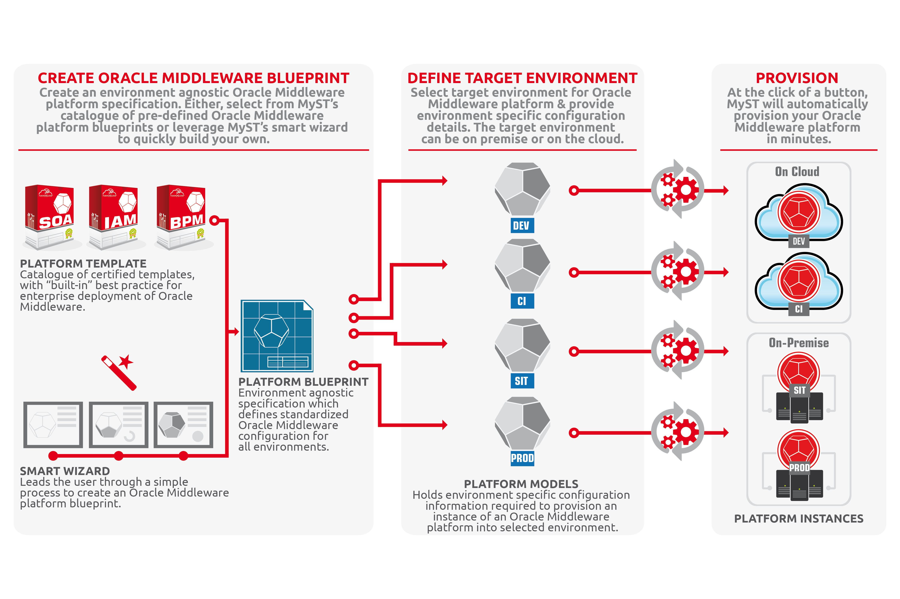

#Platform Management
Central to MyST is the Platform Blueprint, an environment agnostic specification used to define a standardized Oracle Middleware topology and configuration. This, provides an abstraction layer over the underlying infrastructure; delivering two key standardization benefits:
1.	Single Blueprint for all your environments.
2.	Single Blueprint for all infrastructure types – Virtualized, Bare Metal, Engineered Systems and Cloud

For each environment, we create a separate platform model to define all the environment specific configuration information. Creating a platform blueprint, platform model and provisioning a new fully operational FMW environment, is a simple three step process, which can be performed in minutes.

The Platform Blueprint and Model are placed under version control; allowing us to treat configuration as code. This gives us the flexibility to provision a consistent middleware platform across all environments, as well have the ability to roll forward / backwards to a different version of the platform and hence eliminate the possibility of configuration drift.