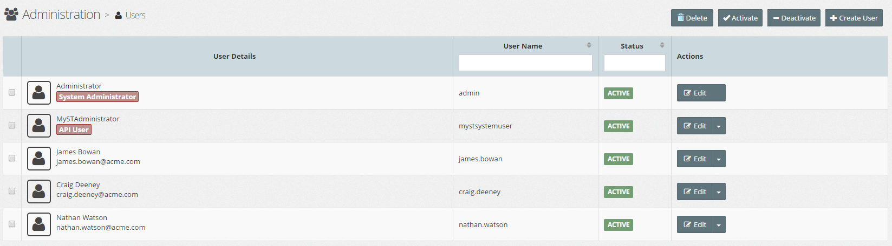

# Role Management

Within MyST, a Role is used to define the type of MyST resources that a user in that role has access to, and the actions that can be performed against the resources, specifically it  will define:
* What actions a user can perform against each resource type, for example Platform Blueprints / Models, Platform Instances, Artifacts, Application Blueprint / Models.
* Where a resource is Environment specific (e.g. DEV, TEST, QA, etc), for example Platform Model / Instance, Application Models;  then the role will define which actions can be performed against each the resource in each environment.
* A separate reserved MyST Administrator Role will be used to manage system specific configurations, for example user and role management, tag management
* A separate reserved MyST Workspace Administrator Role will be used to manage workspace specific configurations, for example defining which users have which roles within a workspace.

## List Roles
To see a list of MyST Roles, click  `Administration` > `Roles`. This will display a list of Roles similar to the one below.

The list can be filtered / sorted by User Name or Status, by entering the filter criteria in the filter fields (outlined in red in the above screen-shot)/

## Creating a New User
Click `+ Create Role`, this will open the **Add Role** dialogue. Specify the following values:

* **First Name** - First name of the user
* **Last Name** - Last name of the user
* **EMail Address** - Users email address
* **Username** - Username for the account, can only consist of alphanumeric, period and underscore characters. Must be unique within MyST.
* **Password** - User Password
* **System Specific Roles** - To assign the user System Admin status, enable the `System Administrator` check-box.

Click `Create` to Save the create the User Account. Once saved the user will be able to login into MyST with the provided username and password. 

**Note**: At this point the user will not have any privileges to perform any actions within MyST.

## Edit User Account
To edit the user account; click on the `Edit` button for the corresponding User, this will open the **Edit User** dialogue.

Here you can modify the First Name, Last Name, Email Address and System Specific Roles of the User. Once done, click `Save` to confirm your changes.

### Change User Password
To reset the user password, from within the Edit User dialogue, click `Change Password`,  this will open the **Change Password** dialogue. Enter the new password and click `Change Password` to confirm.

### Change Username
To change the username, from within the Edit User dialogue, click `Change Username`,  this will open the **Change Username** dialogue. Enter the new username and click `Change username` to confirm.

## Activate / Deactivate User
By default, when you create a User, it is in an active state. Meaning that the user is able to log into MyST and perform any actions for which they have been granted privileges.

To disable access to MyST, we can deactivate the User Account.

**Note**: 
* Deactivating a User account does not remove any workspaces roles they have been granted, but prevents them from logging in and performing any of those roles.
* A deactivated User account can be reactivated at any time.

To deactivate a User account; click on the  **Actions** drop-down menu for the corresponding User and select `Deactivate` as illustrated below.

To activate a deactivated environment; click on the  **Actions** drop-down menu for the corresponding User account and select `Activate`.