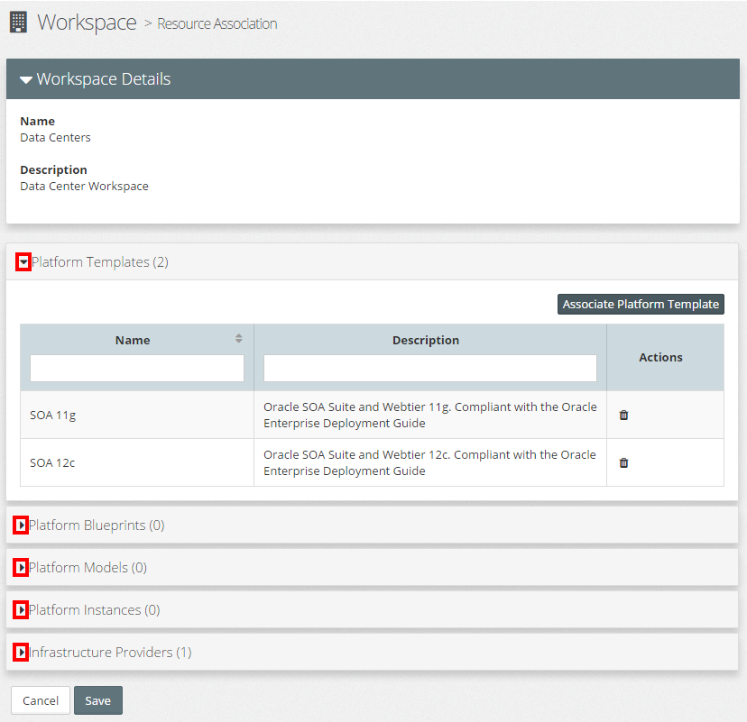
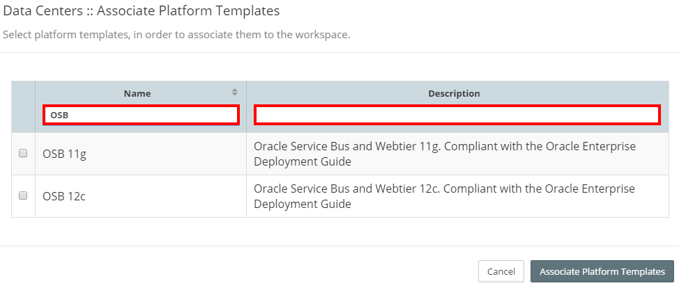

# Workspace Management

MyST Workspaces are a flexible way to associate users with particular work streams within an organization. These could be project based, for example a SOA development project or team based, for example the Middleware Operations team. 

A MyST Workspace is a collection of related resources, such as Platform Blueprints, Platform Instances, etc. Users can be assigned one or more roles in a workspace, which will define what actions they can perform against resources within that workspace.

Within MyST, a Role is used to define the type of MyST resources that a user in that role has access to, and the actions that can be performed against the resources, specifically it  will define:
* What actions a user can perform against each resource type, 
* Where a resource is Environment specific (e.g. DEV, TEST, QA, etc), for example Platform Model / Instance, Application Models;  then the role will define which actions can be performed against each the resource in each environment.
* A separate reserved MyST Administrator Role will be used to manage system specific configurations, for example user and role management, tag management
* A separate reserved MyST Workspace Administrator Role will be used to manage workspace specific configurations, for example defining which users have which roles within a workspace.

    
MyST administrators define roles in MYST. That is, all workspaces have the same roles available to them. Users may have different roles in different workspaces, and a user can be assigned to multiple roles within a workspace.

RBAC will provide workspaces which are containers for related resources (for example the SOA Platform could be the workspace for Platform Blueprints, Platform Models and Instances that make up the SOA Platform).
 
For each Workspace, MyST will allow you to configure:
Which users have access to a workspace, and what role(s) they are able to perform in that workspace.
The role defines what actions a user can perform against each resource type (for resources contained within the Workspace)
Where a resource is mapped to an environment (for example a Platform Model or Platform Instance to a DEV environment) then the role will define which actions can be performed against that resource in each environment (for example DEV, TEST, PROD).
A user may belong to multiple workspaces.
 
When creating a resource with a Parent resource (e.g. Platform Model has a Platform Blueprint), then by default the Platform Model will automatically be added to the workspaces of its Parent.
 
It is envisaged that organizations will use Workspaces in multiple ways, based on how they structure the delivery of work, for example:

It is envisaged that organizations will use Workspaces in multiple ways, based on how they structure the delivery of work, for example:

Each user has an individual account that at a minimum includes a unique login id, username and password. 

Within MyST, **users** are not assigned permissions directly, but only acquire them through the **role(s)** assigned to them within one or more **workspaces**. 

Users can also be assigned System Roles, which will enable them to manage system specific configurations.

## List Workspaces
To see a list of MyST Workspaces, click  `Administration` > `Workspaces`. This will display a tiled view of Workspaces similar to the one below.

For each workspace, MyST provides summary of the number of resources contained in the workspace, including:
* Users
* Platform Templates
* Platform Blueprints
* Platform Models
* Platform Instance
* Infrastructure Providers

## Creating a New Workspace
Click `+ Create Workspace`, this will open the **Add Workspace** dialogue. Specify the following values:

* **Name:** Name of the Workspace
* **Description:** Description of the Workspace

Click `Save` to create the Workspace. Once saved the user will be able to login into MyST with the provided username and password. 

**Note**: At this point the user will not have any privileges to perform any actions within MyST.

## Configure Users
To configure workspace users; click on the click on the  **Actions** drop-down menu for the corresponding Workspace and select `Configure Users`, as illustrated below. 

This will open the **Configure Users** dialogue.

###Add User
To add new users to the Workspace, click `+ Add Users`, this will open the **Add Users** dialogue. This will display the list of users and roles defined to MyST.

The list can be filtered / sorted by User Name, First Name, Last Name or Email Address, by entering the filter criteria in the filter fields (outlined in red in the above screen-shot).

To choose the user(s) we wish to add to the workspace, simply select the corresponding checkbox for each user required.

Once selected the next step is to choose the roles we wish to assign to the selected users. The role list can be filtered / sorted by role Name by entering the filter criteria in the filter fields.

To specify the roles(s) we want to provide to the selected users in the workspace, simply check the corresponding checkbox for each role required.

Once we have specified the users and there corresponding roles, click `Add Users` to confirm our selection and return to the `Configure Users` dialogue. From here we **must** click Save to save our changes to the Workspace.

**Note:** we can select a user already assigned to the workspace, for example if we want to assign them another role.

###Edit User

###Delete User

## Associate Resources
Users within a Workspace are only granted access privileges against resources that are associated to the workspace. 

**Note:** Resources can be associated with multiple workspaces.

When we first create a resource, we need to specify the workspace(s) to which we want to associate the resource. Once created, then if we want to associate the resource with additional workspaces or remove its association with a workspace, we perform this activity as party of Workspace Administration.

Within Workspace Administration; click on the click on the  **Actions** drop-down menu for the corresponding Workspace and select `Associate Resources`, this will open the **Associate Resources** dialogue.

For each *Resource Type*, MyST will provide a summary of the number of resources associated with this workspace and by default expand the Platform Templates section to list the Platform Templates associated with the Workspace.

Click on the corresponding `>`expand icon (outlined in red in the above screen-shot) to expand the resource type you are interested in.

###Add Resource Association
To add a Resource Association expand the corresponding resource type and click on `Associate <Resource Type>` (for example `Associate Platform Template`). This will open the corresponding `Associate <Resource Type>` dialogue.

The list can be filtered / sorted by Name and Description, by entering the filter criteria in the filter fields (outlined in red in the above screen-shot).

To choose the resource(s) we wish to associate with the workspace, simply select the corresponding checkbox for each user resource.

Once we have specified the resources, click `Associate <Resource Type>` to confirm our selection and return to the main `Associate Resource` dialogue. From here we **must** click Save to save our changes to the Workspace.

###Delete Resource Association
To delete a Resource Association expand the corresponding resource type and click on the delete icon in the *Actions* column. This will remove the corresponding resource association from the Workspace. Finally click `Save` to save our changes to the Workspace.

## Edit Workspace
To edit a workspace; click on the click on the  **Actions** drop-down menu for the corresponding Workspace and select `Associate Resources`, this will open the **Associate Resources** dialogue.

Here you can modify the Name and Description of the Workspace. Once done, click `Save` to confirm your changes.

## Activate / Deactivate Workspace
By default, when you create a Workspace, it is in an active state. Meaning that **Users** and **Resources** can be assigned to a **Workspace** to provide the corresponding access permissions to resources within that workspace.

We can deactivate a Workspace at any time. Deactivating a Workspace does not remove any workspaces roles a user has been granted, but deactivates the permissions they have been granted through that role.

A deactivated workspace can be reactivated at any time, at which point any user assigned a role within that workspace, will receive back the corresponding access permissions.

To deactivate a Workspace; click on the  **Actions** drop-down menu for the corresponding Workspace and select `Deactivate` as illustrated below.

To activate a deactivated environment; click on the  **Actions** drop-down menu for the corresponding Workspace and select `Activate`.

## Delete Workspace
To delete a Workspace; click on the  **Actions** drop-down menu for the corresponding Workspace and select `Delete`. We will be prompted to confirm out action, click `Yes` to proceed.

**Note:** You will need to delete all Resource Associations from a Workspace prior to deleting it.
