## {{ page.title }}

The Release Pipeline Dashboard provides a ‘single pane of glass’ to monitor and manage the promotion of applications and platform configuration changes through each staging environment and into Production.

To view the dashboard of an active Release Pipeline; from the side menu navigate to`Release Management > Pipelines`, this will display a list of existing Release Pipelines. 

Click on the `Actions` drop-down in the top right-hand corner of the pipeline whose dashboard we wish to view and select `Dashboard`.

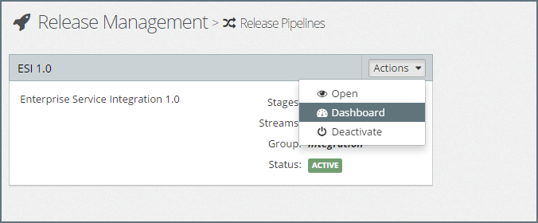

The remainder of this section takes us on a tour of the Release Pipeline Dashboard, covering the following topics:
* Platform Blueprint and Application Blueprint Revision Tracking
* Platform Model and Application Model Revision Tracking
* Build Stage
* Deployment to the First Staging Environment
* Understanding the Deployment Status
* Promoting a Release into a Staging Environment
* Troubleshooting a Failed Deployment
* Updating the Application Model and Re-Deploying
* Forcing a Redeploy

### Platform Blueprint and Application Blueprint Revision Tracking
Each stream in a Release Pipeline is used to manage the promotion and deployment of a set of related components, consisting of a Platform Blueprint and zero, one or more Application Blueprints. 

Any change to any of these components results in a new revision of that component. MyST keeps track of all revisions and which revision of each of these components has been promoted to each stage.

When promoting a release from one stage to the next, the components are not promoted individually, but as the collection of components defined in the release stream. Each time a deployment is made into the first stage environment (for example CI), MyST creates a new Stream Revision which is a logical snapshot of the Platform Blueprint revision and Application Blueprint revision deployed into that staging environment.

MyST keeps track of all revisions and which revision of each of these components has been promoted to each stage. The following notation is used to indicate the revision of each component:
* **Platform Blueprint Revisions** - The revision of a platform Blueprint is indicated by the notation `prn`. Where `pr` is the standard prefix for a platform blueprint revision and `n` is the revision number. For example `pr4` would indicate revision 4 for the specified Platform Blueprint Version.
* **Application Blueprint Revision** - The revision of an Application Blueprint is indicated by the notation `arn`. Where `ar` is the standard prefix for an Application Blueprint revision and `n` is the revision number. For example `ar3` would indicate revision 3 for the specified Application Blueprint Version.
* **Stream Revision** - The revision of a Stream release is indicated by the notation `srn`. Where `sr` is the standard prefix for a Stream revision and `n` is the revision number. For example `sr5` would indicate stream revision 5.

In addition to each stage, the dashboard also illustrates the `Build` stage, which shows the latest revision of each component available for promotion through the release pipeline. 

### Platform Model and Application Model Revision Tracking
In addition to tracking revisions to Platform Blueprints and Application Blueprints, MyST also tracks any revisions to either Platform Models or Application Models in each staging environment.

For example, a user may modify the set of properties defined in an Application Model, whilst this has no impact on the corresponding Application Blueprint. It does impact the configuration of the artifacts contained within the Application Blueprint for **the stage** that the Application Model applies. Thus it is important to track these changes, so MyST knows that the Application Blueprint needs to be redeployed, and allows us to cross-reference test results to particular configurations.

In addition, in a similar way that MyST creates a Stream Revision to track related components together, MyST creates a Stream Model Revision for each stage to track any model changes that impact that staging environment.

> Note: The Stream Model Revision is tracked separately for each stage.

MyST keeps track of all model revisions and which revision has been applied to each component promoted into a stage. The following notation is used to indicate the model revision applied to each component:
* **Platform Model Revisions** - The revision of a Platform Model is indicated by the notation `pmn`. Where `pm` is the standard prefix for a platform model revision and `n` is the revision number. For example `pm2` would indicate revision 2 for the specified Platform Model.
* **Application Model Revision** - The revision of an Application Model is indicated by the notation `amn`. Where `am` is the standard prefix for an Application Model revision and `n` is the revision number. For example `am2` would indicate revision 2 for the specified Application Model.
* **Stream Model Revision** - The revision of a Stream Model is indicated by the notation `smn`. Where `sm` is the standard prefix for a Stream Model revision and `n` is the revision number. For example `sm5` would indicate stream model revision 5.

### Build Stage
In addition to each stage, the dashboard also illustrates the `Build` stage, which shows the latest revision of each component available for promotion through the release pipeline. 

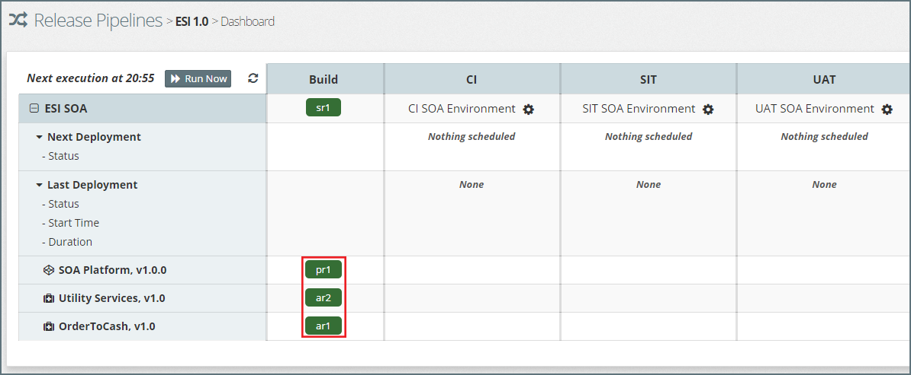

For example, in the above screenshot, we can see that the following components (outlined in red) are available for deployment into the `CI` stage:
* `pr1` of SOA Platform Blueprint v1.0.0
* `ar2` of Utility Service v1.0
* `ar1` of OrderToCash

The stream revision in the build stage is used to indicate the **next** stream revision available for release into the first staging environment. The content of this release is **not** finalized until the deployment of this release is triggered. In other words, additional changes, prior to triggering of this release, which result in a new revision to either the Platform Blueprints or any of the Application Blueprints will be included in this stream revision.

### Deployment to the First Staging Environment
When the promotion rule for the first staging environment is defined as `automatic`, MyST will periodically check to see if there are any new revisions in the build stage ready for deployment, and if so queue a deployment job against the platform instance, as indicated by the `Pending` status for `Next Deployment` in CI Stage in the screenshot below.

> Note: The `Next execution at` indicates when MyST will next check for new revisions to be promoted. This can be overridden by clicking `Run Now`.

If the promotion rule for the first staging environment is defined as `Manual`, MyST will indicate that a release is `Ready for Release`, which can then be triggered manually (see below for further details).

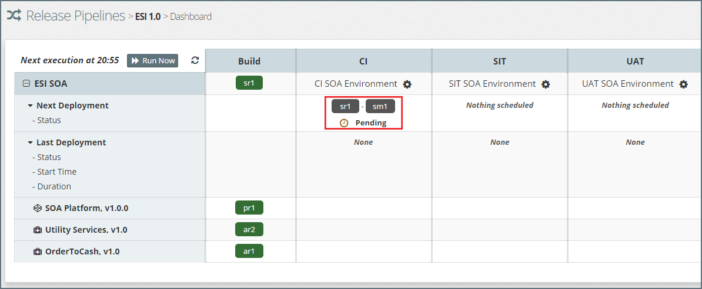

The deployment job will be placed in the job queue for the Platform Instance. This is to prevent multiple jobs for the same platform instance running in parallel. Once all preceding jobs (if any) in the queue have been completed then the deployment job will be initiated. The status of the deployment will change from `Pending` to `In Progress` as shown below.

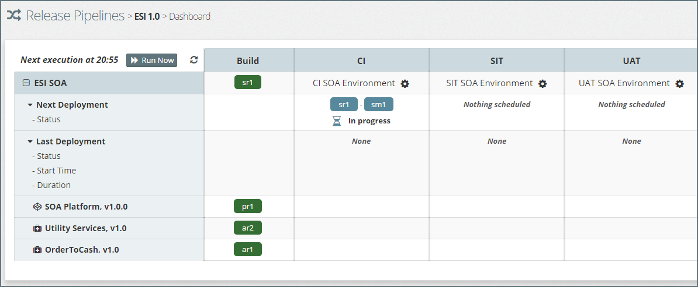

### Understanding the Deployment Status
Once the deployment job has executed, the dashboard will be updated to show the status of the last deployment.

The `Last Deployment` section will highlight the Stream Revision and the Stream Model Revision of the last deployment, in the format `srn - smn`. This will be color coded:
* **Green** - to indicate a successful deployment.

* **Red** - to indicate a failed deployment.

In addition, the dashboard will display the `Status`, `Start Time` and `Duration` of the deployment job.

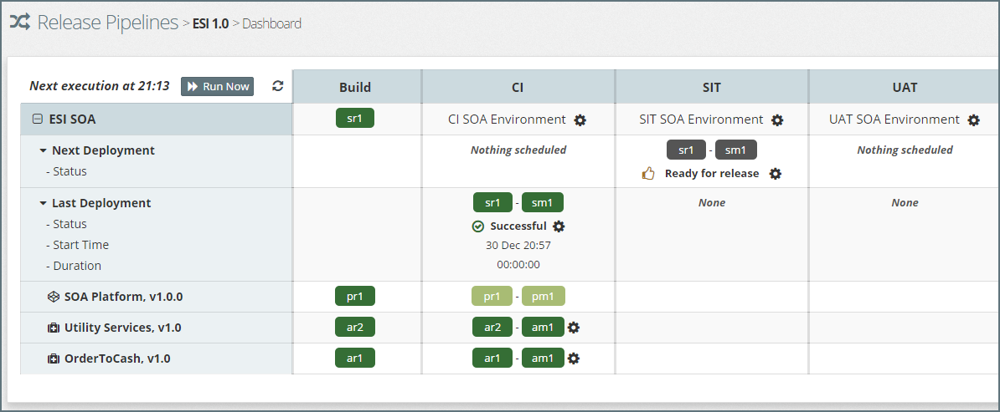

For each Platform Blueprint and Application Blueprint, MyST will show the corresponding Blueprint Revision and Model Revision. These are color coded as follows:
* **Green** - Indicates a successful deployment.

* **Light Green** - Indicates that no deployment was necessary, as there had been no change that impacted the deployed component since the last successful deployment.

* **Red** - to indicate a failed deployment.

#### Viewing the Deployment Log
To view the stage deployment log of a component, click on the `Cog` icon next to the corresponding blueprint - model revision for the component, and select `View Log` as illustrated below.

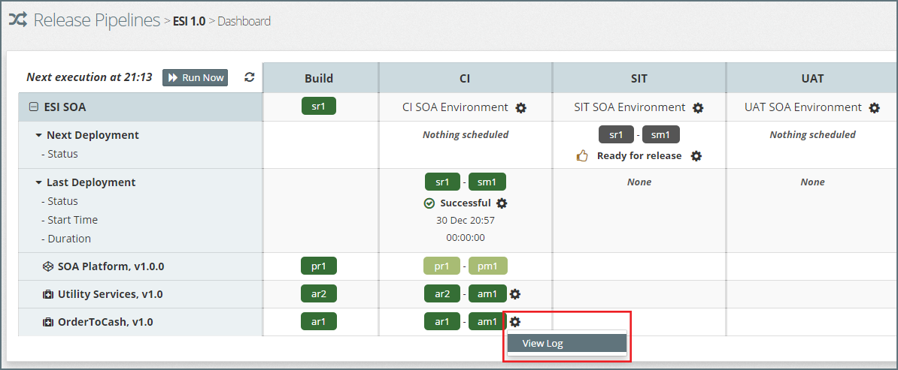

#### Viewing the List of Deployed Artifacts
To view the list of artifacts deployed to a stage, click on the `Cog` icon next to the corresponding platform instance and select `Deployed Artifacts`.

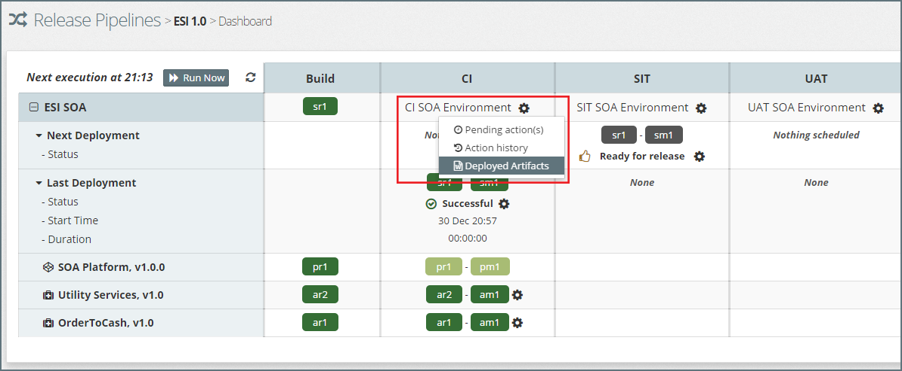

MyST will display the list of artifacts currently deployed to that Platform Instance. For each artifact it displays:
* **Artifact Group Id** - The maven group id of the artifact.

* **Artifact Id** - The maven artifact id of the artifact.

* **Artifact Version** - This is the artifact binary version. 

* **Build No** - The build number of the artifact

* **Artifact Name** - The artifact name

This list can be sorted by clicking on the appropriate column heading.

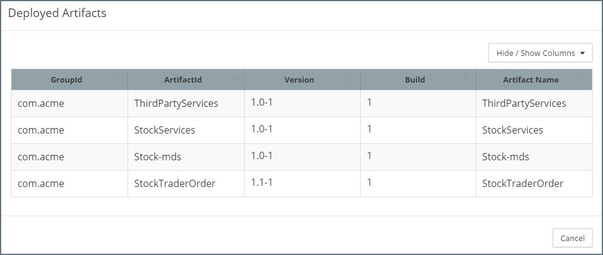

#### Viewing Pending Action(s)
To view the Pending Action(s) for a Platform Instance in the Release Pipeline, click on the `Cog` icon next to the corresponding platform instance and select `Pending Action(s)`.

This will display a list of all scheduled actions against the Platform Instance, enabling us to determine if there are any actions queued ahead of our deployment actions.

#### Viewing the Action History
To view the Action History for a Platform Instance in the Release Pipeline, click on the `Cog` icon next to the corresponding platform instance and select `Action history`.

This will open up the action history for the Platform Instance, which will show the history of all actions performed against the Platform Instance, not just those performed by the Release Pipeline.

### Promoting a Release into a Staging Environment
Once a release has been successfully deployed into a staging environment and has successfully executed any Post Deployment jobs, including the execution of automated tests, MyST will mark the corresponding Stream Revision as `Ready for Release` in the next staging environment.

If the promotion rule for the staging environment is defined as `Manual`, MyST will set the status of the `Next Deployment` as `Ready for Release` as well as indicate the stream revision plus corresponding stream model that is ready for revision.

To trigger the release, click on the `Cog` icon next to the corresponding `Ready for Release` status, and select `Deploy Release` as illustrated below.

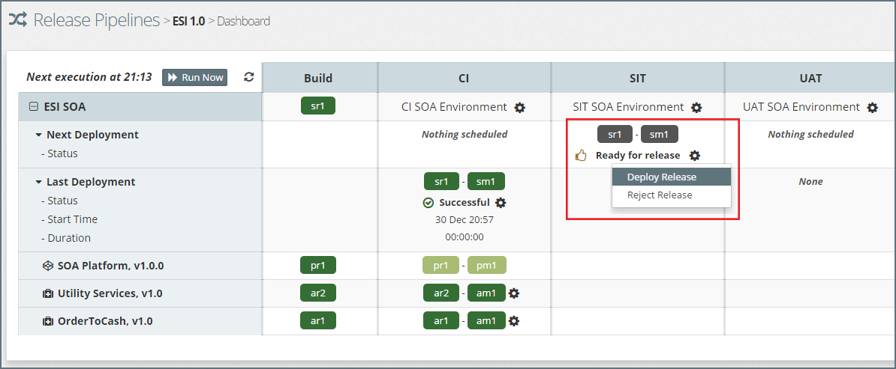

MyST will open the `Revision Selection` dialog, where we can select which stream revision we wish to deploy and the corresponding stream model revision.

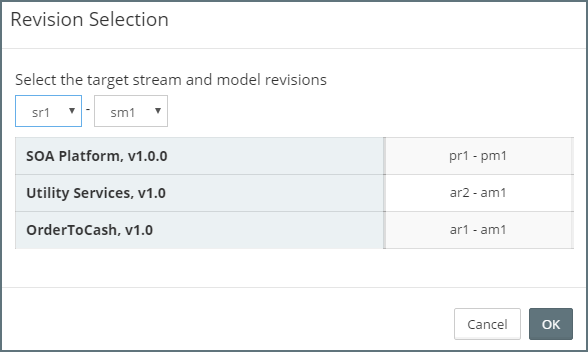

> It is quite common, especially in the case of manual releases, for several stream revisions to be available for release at the same point in time. For example, we may make several releases a day into the CI environment, but choose to release daily into the test environment. In these scenarios MyST defaults to the latest successful stream revision, but allows us to select an earlier stream revision if required.

For the selected Stream Revision, MyST will show the corresponding platform blueprint and application blueprint revisions that make up this release. Once we are happy with the selected revision, click `OK`

MyST will queue a deployment job against the corresponding platform instance. And set the status of the next deployment to `Pending`. As soon as the job starts executing, its status will be updated to `In progress`.

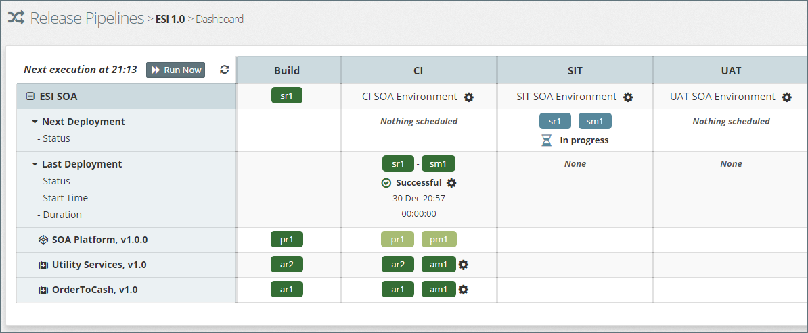

### Troubleshooting a Failed Deployment
There will, of course, be times when a deployment fails for a variety of reasons. In such cases, it is important to be able to quickly identify where the failure occurred, so we are able to identify the root cause.

When a deployment fails, the status of the last deployment is set to `Failed` and the stream revision and stream model revision for that deployment is highlighted in red, as illustrated below.

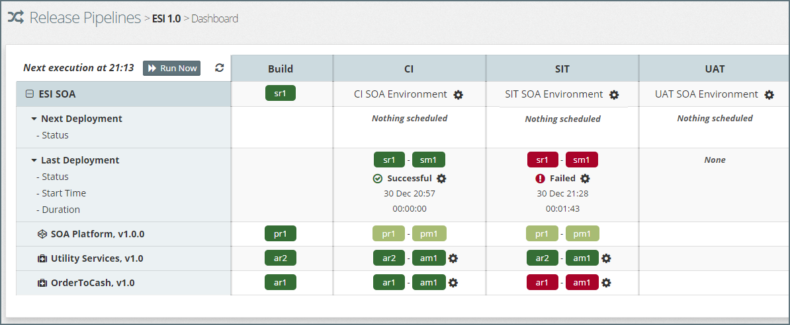

When MyST executes a stream deployment, it first deploys any updates to the Platform Blueprint and then sequentially deploys the Application Blueprint, skipping any components which have not changed since the last sequential deployment. If deployment of any component fails then deployment of the stream is aborted at that point.

MyST will color code the status of each component to indicate whether it was deployed successfully or not:
* **Green** - Indicates a successful deployment.

* **Light Green** - Indicates that no deployment was necessary, as there had been no change that impacted the component since the last successful deployment.

* **Red** - Indicate a failed deployment.

* **Gray** - Indicates that MyST did not attempt to deploy that component due to an earlier failure.

To identify the root cause of the failed deployment, click on the `Cog` icon next to the failed component and select `View Log`. This will open the deployment Execution log file for that component.

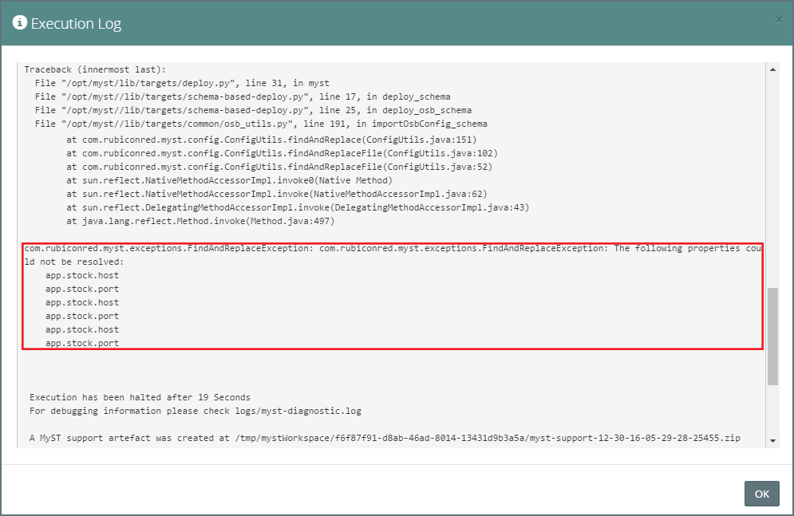

Looking at the log file we can see that we have not defined the following application (`app.`) properties:
* stock.host
* stock.port

### Updating the Platform Model and Re-Deploying
The above issue can easily be resolved by setting these properties in the Platform Model for the SIT Platform Instances. See [Platform Model Editor](/platform/definitions/editor/README.md) for details on how to do this.

Once the Platform Model has been updated, the next execution of the Release Pipeline will detect the updated Platform Model and set the status of the release to `Ready for release`.

Select the option to `Deploy Release`, ensuring the latest Stream Model is selected.

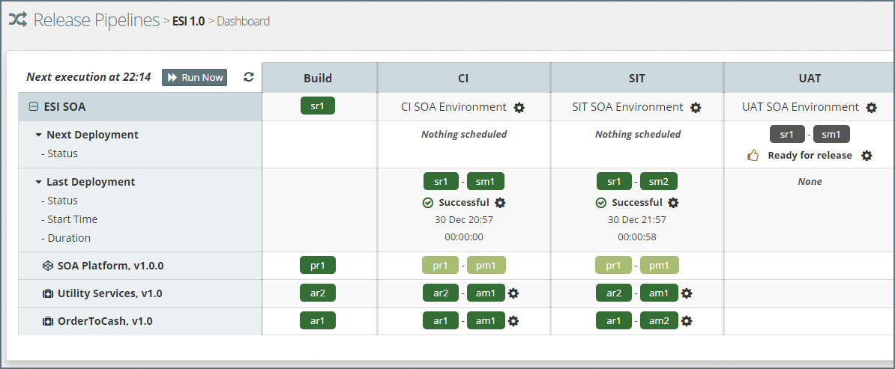

From this we can see that the Stream Revision has been successfully deployed, and that the Application Model revision and the corresponding Stream Revision has been also been incremented to reflect the change at the model level.

We can also see that the Stream Revision is also available for deployment to the UAT Stage.

### Forcing a Redeploy
To redeploy the last release to a stage, click on the `Cog` icon next to the last deployment status and select `Redeploy`. 

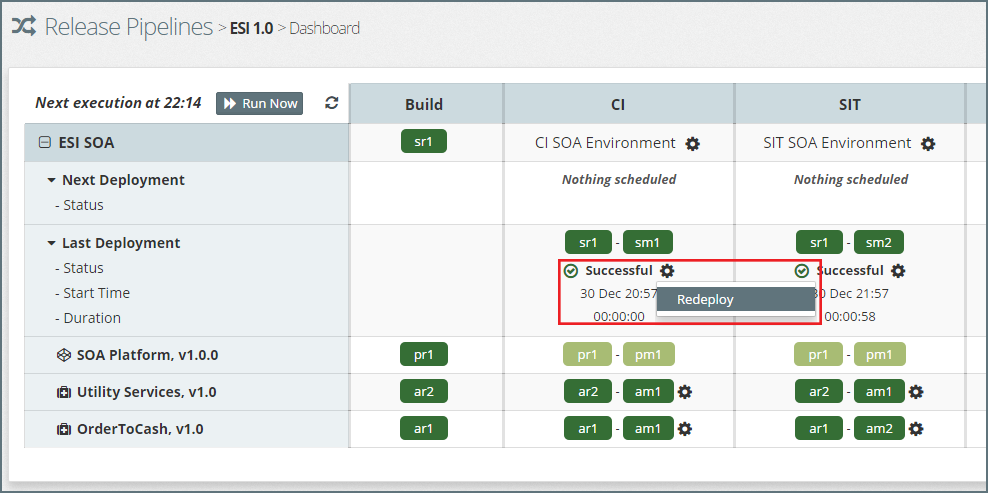

This will open the redeploy dialog.

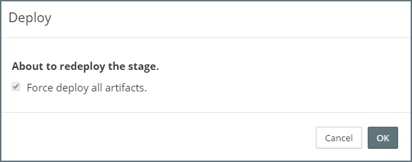

MyST's default behavior when deploying a release is to only deploy the artifacts that have been changed since the last deployment. In the event of an Application Model change it will redeploy all the artifacts contained within that Application Model.

Here we have the option of selecting `Force deploy all artifacts`. If we select this option, we can force MyST to re-deploy all artifacts contained across Application Blueprints.

Click `OK` to initiate the re-deployment.

