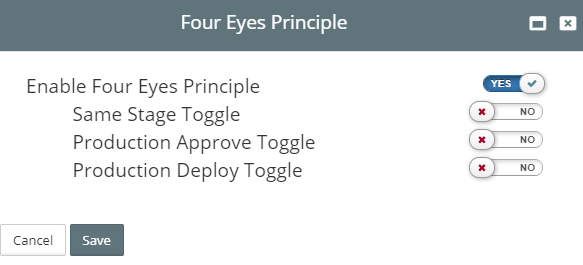
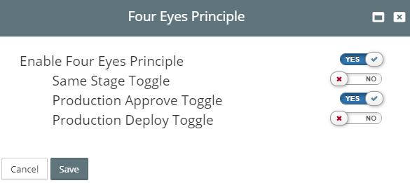

## {{ page.title }}

The objective of this feature is to implement **Four Eyes Principle** for Release pipelines to have more control over deployments to production environments, when everyone in the team has the same level of access.

In order to use this feature follow below steps:

### Enabling Four Eyes Principle

From the side menu, navigate to`Administration > Four Eyes Principle` . 

Click on **Four Eyes Principle**  this will open new wizard.

Once you enable the **Four Eyes Principle** you will see few more toggles.

We will discuss more about this toggles by the end of this post.

Once **Four Eyes Principle** is enabled, select the environment type which is to be considered as **Production Environment**.

### Enabling Production Enivornment

From the side menu, navigate to`Infrastructure > Environment Types`. This will display a list of existing Environment Types, similar to the one below.

Open any one of the existing Environment Type. 

* Environment Type before enabling **Four Eyes Principle**

A new column with name **PROD Environment (Four Eyes Principle)** is visible but it is disabled.

* Environment Type after enabling **Four Eyes Principle**

A new column with name **PROD Environment (Four Eyes Principle)** is visible which can be enabled/disabled (true/false).

Select any environment by enabling the checkbox then that enabled enivronment type will be considered as **Production Environment**.

### Four Eyes Principle Working.

### Consider the below cases.

#### Case-1

When **Four Eyes Principle** is enabled  
And Release Pipeline with a stage consisting of Approver Role and Deployer Role is ready for approve  
And a User **Test** approved the stage  
If the same user **Test** try to deploy the stage  
Then an error will be thrown saying **Deployment failed as you previously approved release to this stage**.

#### Case-2

When **Four Eyes Principle** is enabled  
When PROD Environment Type is selected as **Production Environment**  
And Release Pipeline with a stage consisting of Approver Role and Deployer Role is ready for approve and selected with PROD as Enivornment  
And a User **Test** deployed the previous **Non-Production**, stages  
If the same user **Test** try to approve the **Production** stage  
Then an error will be thrown saying **Cannot approve release in Production environment because you previously deployed to non-production environment**.

#### Case-3

When **Four Eyes Principle** is enabled  
When PROD Environment Type is selected as **Production Environment**  
And Release Pipeline with a stage consisting of Approver Role and Deployer Role is ready for deploy and selected with PROD as Enivornment  
And a User **Test** deployed the previous **Non-Production**, stages  
If the same user **Test** try to deploy the **Production** stage  
Then an error will be thrown saying **Cannot deploy to a Production environment as you have deployed to at least one non-Production environment**.

#### Case-4

A Release Pipeline is already created before enabling **Four Eyes Principle**  
There is stage with PROD E#nvironment and only Deployer Role is selected  
Then **Four Eyes Principle** is enabled  
If the stage contatining PROD Environment is opened  
Then an error will be thrown saying **Approval role is mandatory as it is Production Environment**.

### Feature Toggles

In case of emergency or priority to override above error, this feature toggles plays a crucial role.

#### Case -5

If case-1 occurred  
And want to overcome the error  
Then enable the Feature Toggle **Same Stage Toggle**

#### Case -6

If case-2 is occurred  
And want to overcome the error  
Then enable the Feature Toggle **Production Approve Toggle**

#### Case -7

If case-3 occurred  
And want to overcome the error  
Then enable the Feature Toggle **Production Deploy Toggle**

