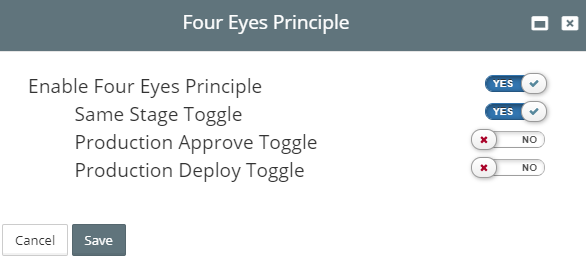

## {{ page.title }}

The **Four Eyes Principle** feature is designed to manage approvals and deployments in production environments for Release Pipelines. The feature can be used in production deployments requiring at least two people to approve and release through the pipeline.

# Enabling Four Eyes Principle

Enabling requires toggling the feature and flagging the production environment.

1. Click `Administration > Four Eyes Principle`   
2. Click `Save`

## Enabling Production Environment

1. Click `Infrastructure > Environment Types`
2. `Edit` your production environment
3. Check **PROD Environment (Four Eyes Principle)** and click `Modify`    

# Scenarios

## Scenario #1 - Allow the same approver and deployer for a stage

Given a Release Pipeline ready for approval  
And user **John_Developer** approved the TEST stage  
When the same user, **John_Developer** tries to deploy the TEST stage  
Then an error will returned as `Deployment failed. You previously approved a release to this stage`

#### Override

## Scenario #2 - Override approval for a user that previously deployed to non-prod

Given user **John_Developer** deployed the non-production stages  
When the same user **John_Developer** approves the Production stage  
Then an error is returned as `Cannot approve release in Production environment because you previously deployed to non-production environment`

#### Override

## Scenario #3 - Override deployment for a user that previously approved non-prod

When user **John_Developer** deployed the previous **Non-Production**, stages  
If the same user **John_Developer** deploys to the **Production** stage  
Then an error is returned as `Cannot deploy to a Production environment as you have deployed to at least one non-Production environment`

#### Override

## Errors

Errors display. In this case the Mandatory Approval Role when using Four Eyes Principle

