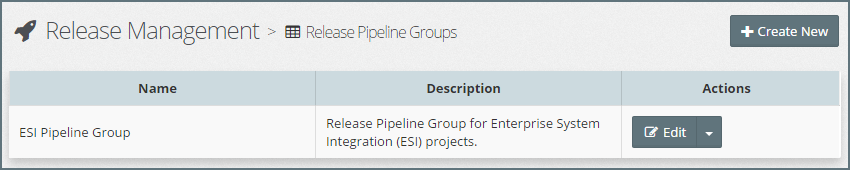
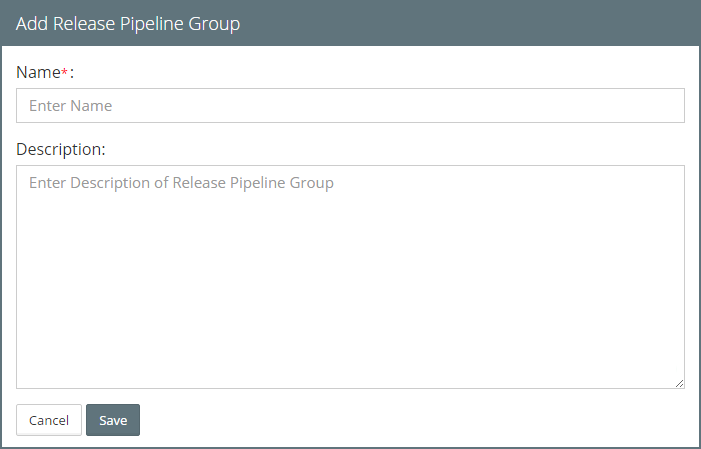

## {{ page.title }}

Release Pipeline Groups allow us to categorize each Release Pipeline. 

For example, say we had an integration project with multiple production releases (for example release 1.0, 1.1, 2.0, and so on). We may choose to create a separate Release Pipeline for each release, but place them in the same Release Pipeline Group.

> Note: It is intended that reporting capabilities to be delivered in future versions of MyST will provide reporting by Release Pipeline Groups, for example, allowing production of a report that shows all active release pipelines for a particular Pipeline Group.

### List Release Pipeline Groups
From the side menu, navigate to`Release Management > Pipeline Groups`. This will display a list of existing Release Pipeline Groups, similar to the one below.

### Creating a New Release Pipeline Group
Click `+ Create New`. This will open the **Release Pipeline Group** dialog. Specify the following values:

* **Name** - Shorthand name for the Pipeline Group.
* **Description** - A longer description of the Pipeline Group.

Click `Save` to Save the new Release Pipeline Group.

## Edit Release Pipeline Group
To edit the Pipeline Group, click on the `Edit` button for the corresponding Pipeline Group. This will open the **Edit Release Pipeline Group** dialog.

Here we can modify the Name and Description of the Pipeline Group. Once done, click `Modify` to confirm the changes.

