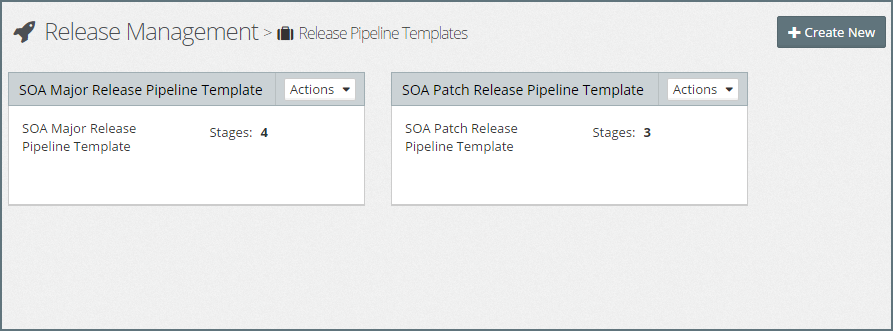
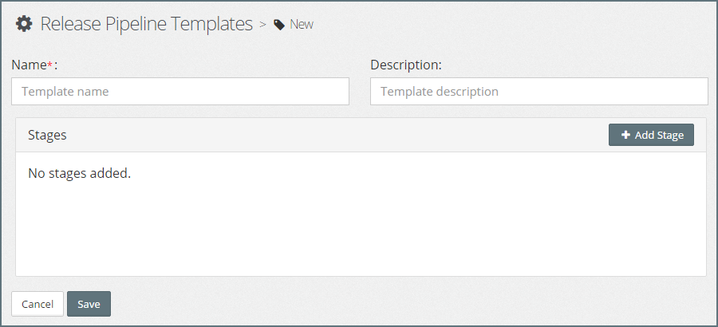
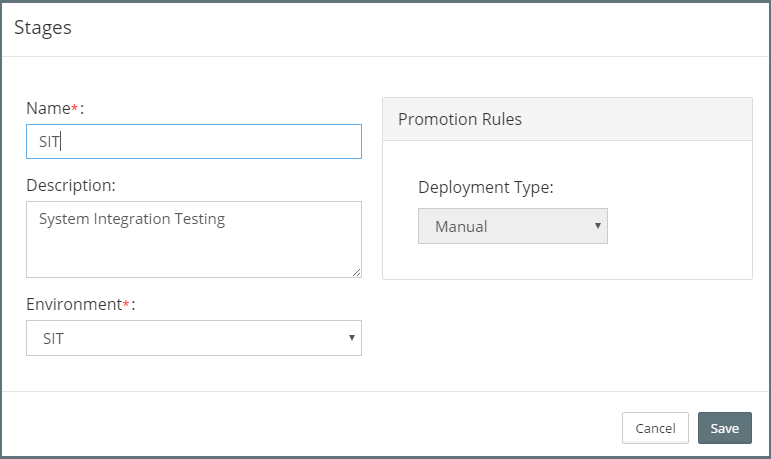
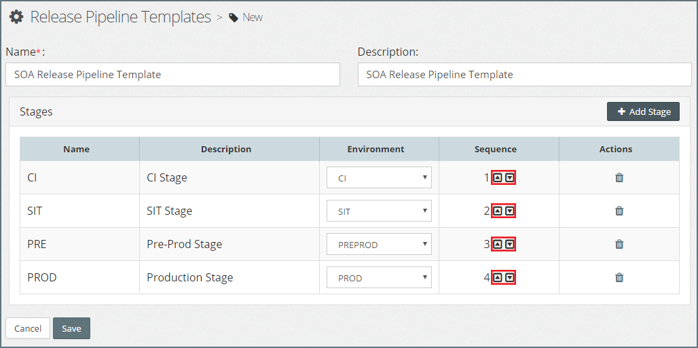
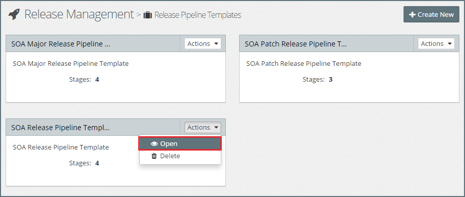

## {{ page.title }}

It is common practice for organizations to have a *"standard"* software delivery lifecycle (SDLC) that they follow for the implementation of Oracle Middleware projects. 

These may vary slightly based on the type of release. For example, we may follow one SDLC for *"project releases"*, but have a shorter SDLC for *"patch"* releases.

Pipeline Templates allow us to pre-define a set of ordered stages with promotion schemes defined for each stage. The value of Pipeline Templates is that they allow us to define a standard approach for each type of release.

So in the above example, we could define two templates: one for project releases and a second for patch releases.

### List Release Pipeline Templates
From the side menu, navigate to`Release Management` > `Pipeline Template`. This will display a list of existing Release Pipeline Templates, similar to the one below.

### Creating a New Release Pipeline Template
Click `+ Create New`. This will open the **Release Pipeline Template** dialog. Specify the following values:

* **Name** - Shorthand name for the Pipeline Template.
* **Description** - A longer description of the Pipeline Template.

Next, we need to define the stages in our Release Pipeline Template.

#### Add Stage
To add a stage, click `Add Stage`. This will open the **Stage** dialog. 

For each stage, we need to specify the following values:

* **Name** - Shorthand name for the stage.
* **Description** - A longer description of the stage.

* **Environment** - The Environment Type to be used for this stage. Only Platform Models with the same environment type will be available for use in this stage.

* **Promotion Rules** - Defines how Application Blueprints and Platform Blueprints are promoted into this stage. This can be either:
    * **Automatic** - Instructs MyST to automatically promote changes to this stage. 
    * **Manual** - Indicates that promotion has to be manually triggered.

Once we have defined our stage, click `Save` to add the stage to our Release Pipeline Template.

> Note: We will need to repeat these steps for each stage we wish to add to our Pipeline Template. For example, if our software delivery lifecycle consists of four stages, CI, SIT, PRE and PROD, then we would add a corresponding stage for each of these to our Release Pipeline template.

#### Sequence Stages
By default, the stages in our Release Pipeline will be sequenced in the order that we created them.

If we wish to change the stage sequence, simply click on the up or down arrow next to the stage (outlined in red in the above screenshot) to move it to an earlier or later stage in the pipeline template.

Once we are happy with our Release Pipeline Template, click `Save` to Save the new Release Pipeline Template.

#### Delete Stage
To remove a stage from the Release Pipeline Template, click on the corresponding  `trash can` icon in the `Actions` column for the stage to be deleted.

### Edit Release Pipeline Template.
To edit the Pipeline Template, from the side menu navigate to`Release Management` > `Pipeline Template`. This will display a list of existing Release Pipeline Templates.

Click on the `Actions` drop-down in the top right-hand corner of the template you wish to edit and select `Open`. This will open the Release Pipeline Template in edit mode.

> Note: Any changes we make to a Release Pipeline Template will only be applied to new Release Pipelines created against the new version of the template.

### Delete Release Pipeline Template.
To delete a  Pipeline Template, from the side menu navigate to`Release Management` > `Pipeline Template`. This will display a list of existing Release Pipeline Templates. 

Click on the `Actions` drop-down in the top right-hand corner of the template you wish to remove and select `Delete`. MyST will prompt for confirmation of the Delete action. Click `Yes` to proceed with the deletion of the Release Pipeline Template.

